# Multi-Purpose Unit Converter Android App

A comprehensive Android application developed by **Mahanth Kanaparthi** using **Java** and **Gradle Kotlin DSL**. This app offers an all-in-one solution for various unit conversions and useful financial and health utilities.

  
Converter

Note: It is inspired from Xiaomi's Calculator App

---

## Table of Contents
- [Purpose](#purpose)
- [Key Features](#key-features)
- [Architecture](#architecture)
- [Build & Project Files](#build--project-files)
- [Testing](#testing)
- [Screenshots](#screenshots)

---

## Purpose

The application is designed to help users perform a wide range of **unit conversions** and **calculations** efficiently with a clean, user-friendly interface.

---

## Key Features

### Unit Conversions
- **Area**
- **Length**
- **Mass**
- **Time**
- **Speed**
- **Temperature**
- **Volume**
- **Data**
- **Force**
- **Energy**
- **Pressure**
- **Numeral Systems**
- **Date Calculations**
- **Discount Calculator**

### Finance Tools
- **EMI Calculator**
- **Investment Calculator**
- **GST Calculator**

### Health Tool
- **BMI Calculator** with animated result display

### Currency Converter
- Powered by [exchangeratesapi.io](https://exchangeratesapi.io)
- Uses **Retrofit** and **Gson**
- Stores rates in **SharedPreferences** for **offline access**

---

## Architecture

Follows **MVC Architecture**:

### Model
- Handles conversion data and logic

### View
- XML layouts for UI
- Custom themes, drawables, and animations

### Controller
- Java classes for each feature's logic and interaction

### Structure
```
com.mk.convert/
├── controller/        # Handles user interactions
├── convert/           # Activities for each conversion
├── model/             # Data models and logic
└── utils/             # Utility classes and dialogs
```

---

## Build & Project Files

- Written in **Java**
- Uses **Gradle Kotlin DSL**
- Project configuration:
  - `build.gradle.kts`
  - `settings.gradle.kts`
  - `libs.versions.toml`
- Gradle wrapper included:
  - `gradlew`, `gradlew.bat`, `gradle-wrapper.properties`

---

## Testing

- **Unit Tests**: Located in `src/test/`
- **Instrumented Tests**: Located in `src/androidTest/`

---

## Screenshots
<table>
  <tr>
      <td>
        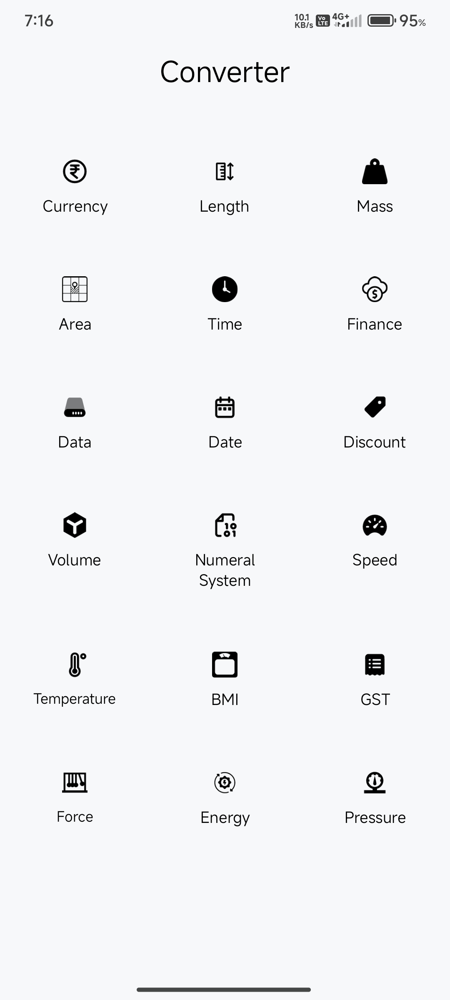
      </td>
      <td>
        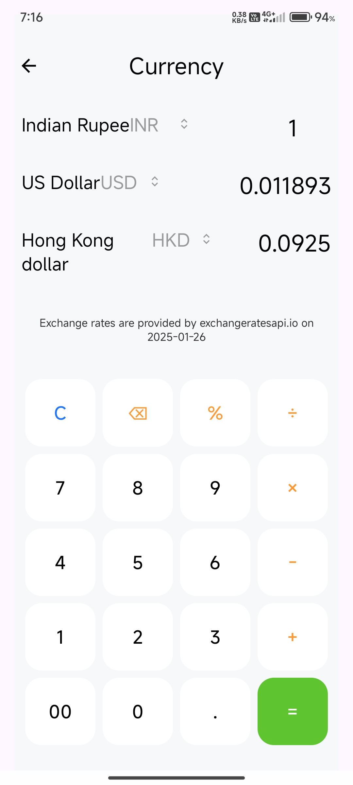
      </td>
      <td>
        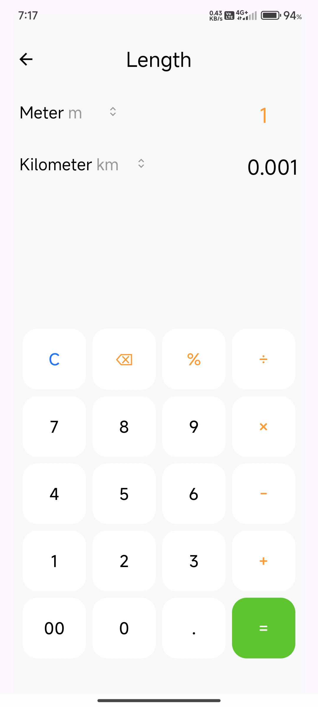
      </td>
  </tr>

  <tr>
      <td>
        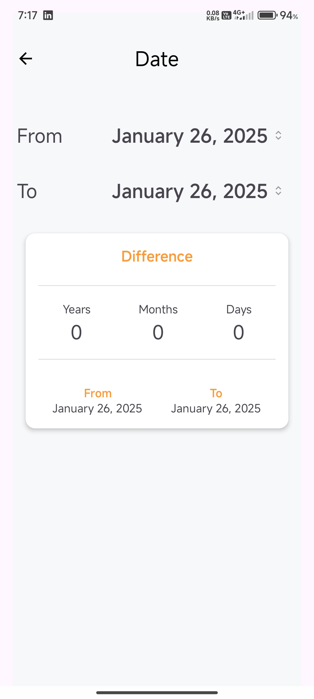
      </td>
      <td>
        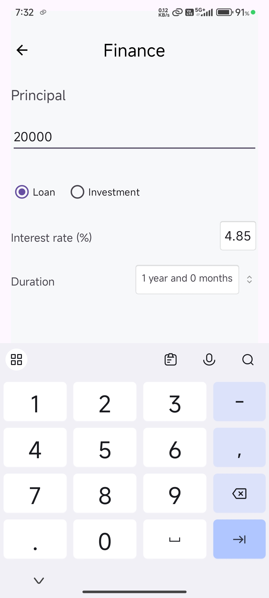
      </td>
      <td>
        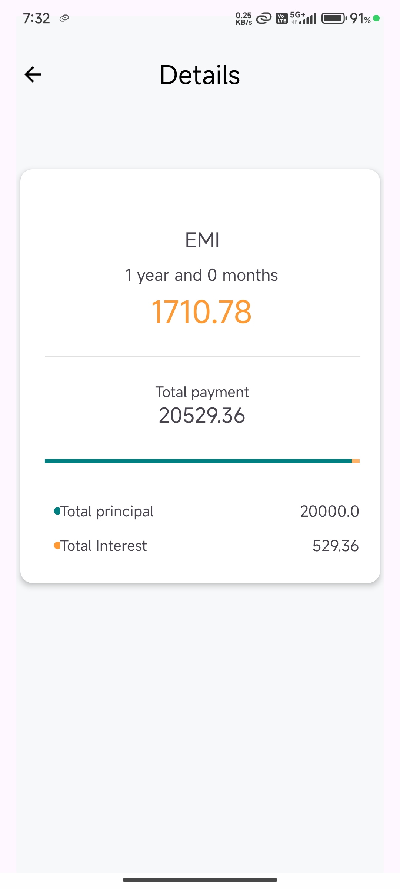
      </td>
  </tr>

  <tr>
      <td>
        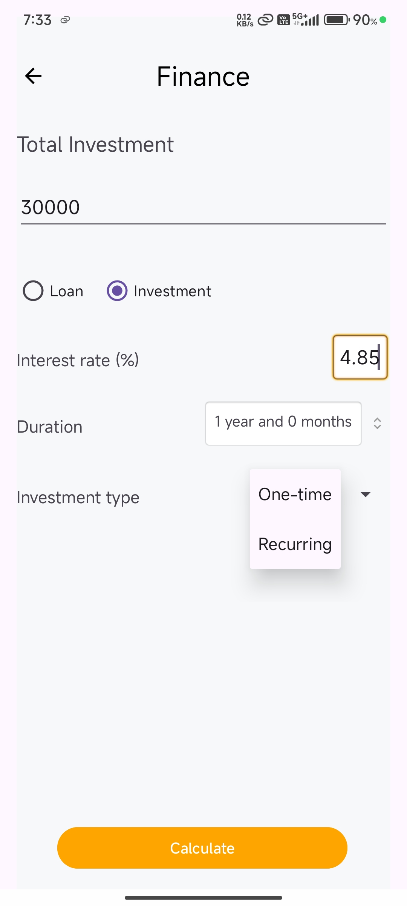
      </td>
      <td>
        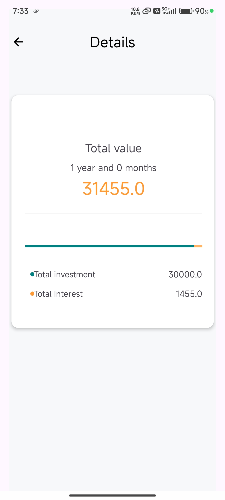
      </td>
      <td>
        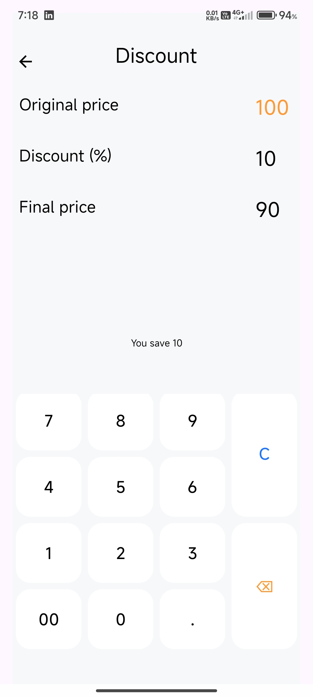
      </td>
  </tr>

  <tr>
      <td>
        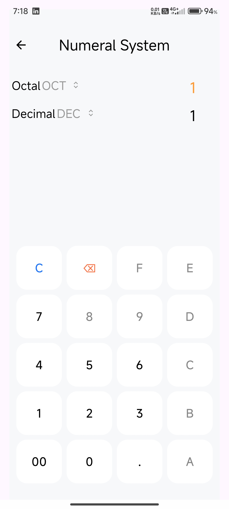
      </td>
      <td>
        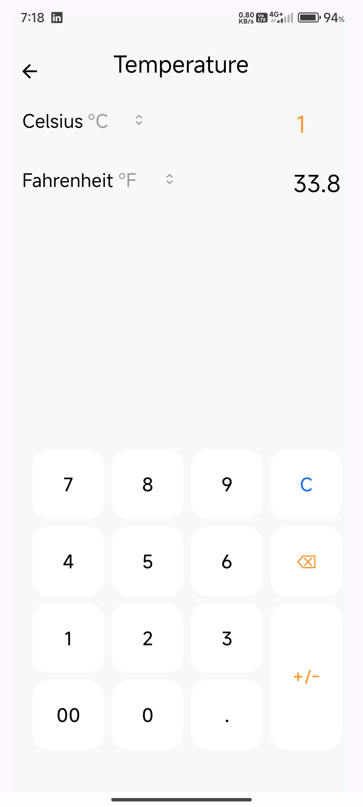
      </td>
      <td>
        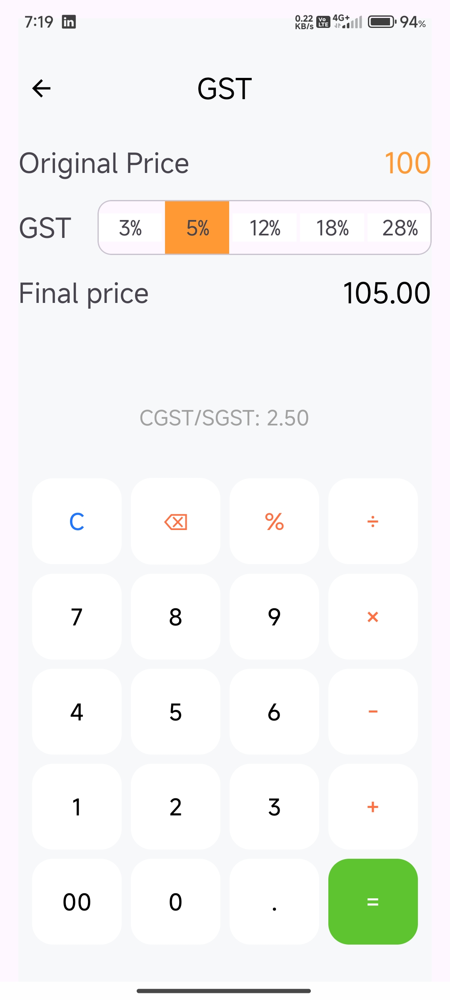
      </td>
  </tr>

  <tr>
      <td>
        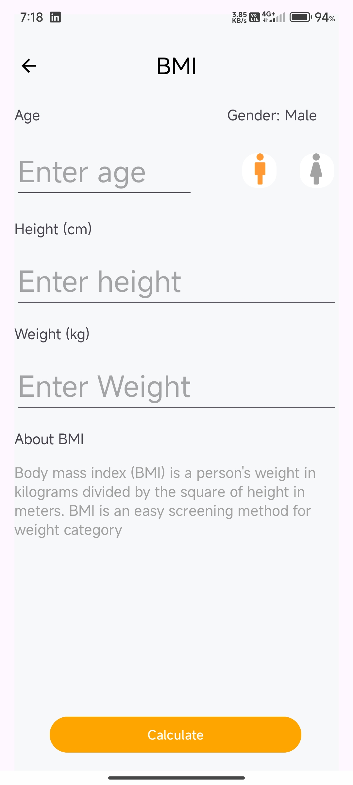
      </td>
      <td>
        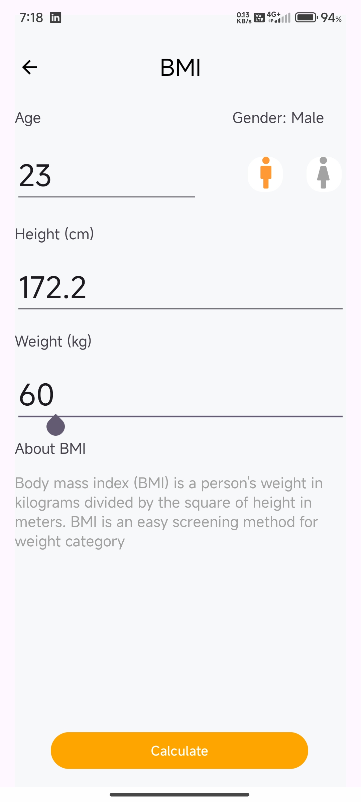
      </td>
      <td>
        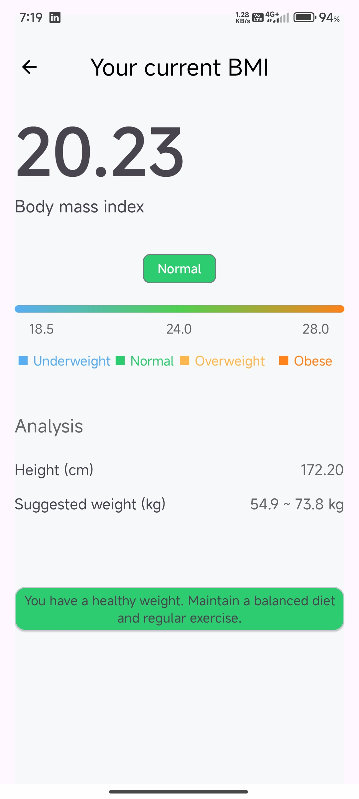
      </td>
  </tr>
</table>

---

## Conclusion

This Android application demonstrates advanced development skills with:
- Modular architecture
- Accurate and efficient conversion logic
- Beautiful, responsive UI
- Offline capabilities and API integration
- Inspired from Xiaomi's Calculator App

Feel free to explore and contribute!

---
